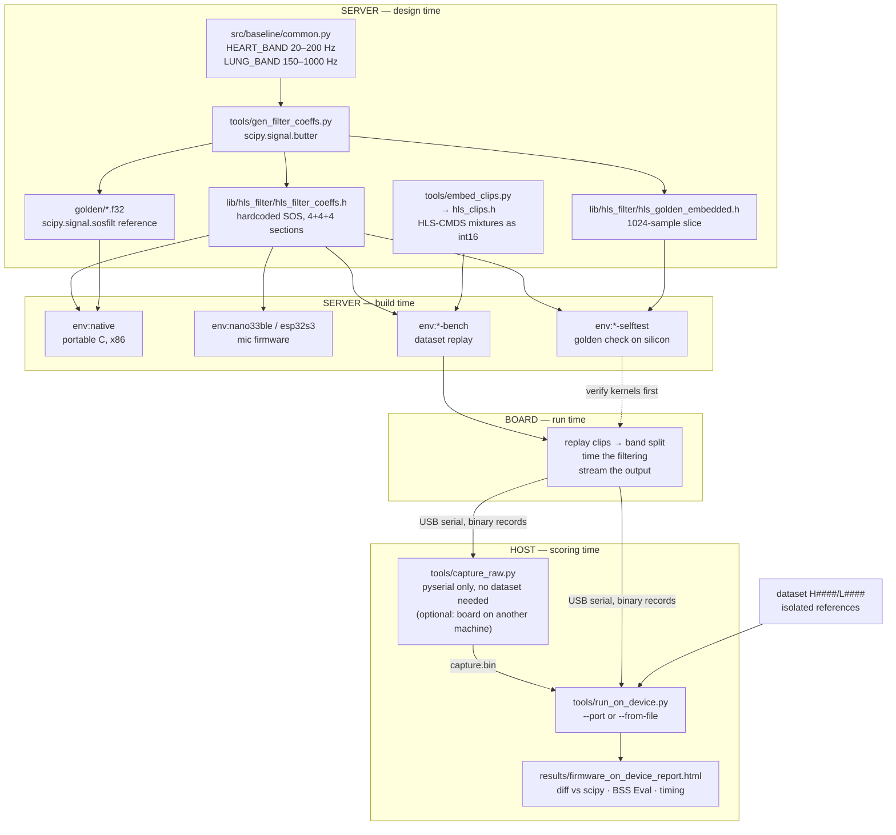
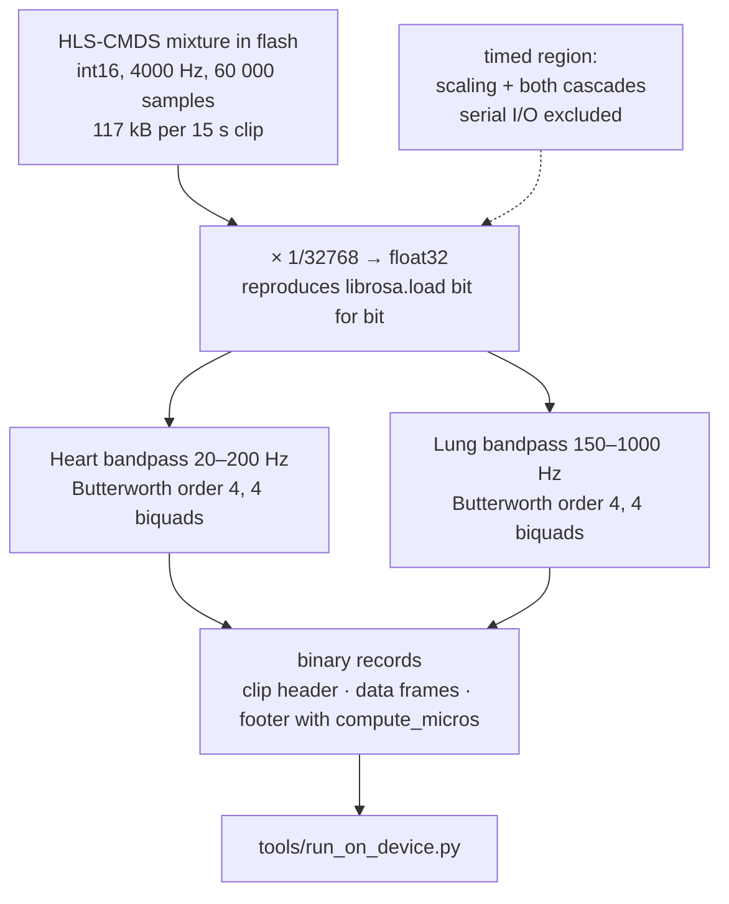
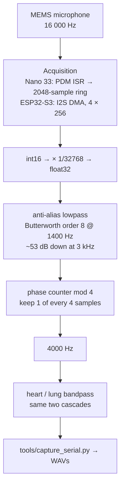
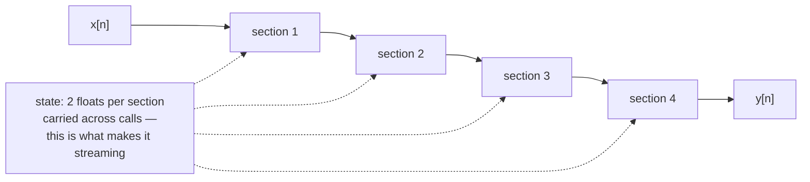
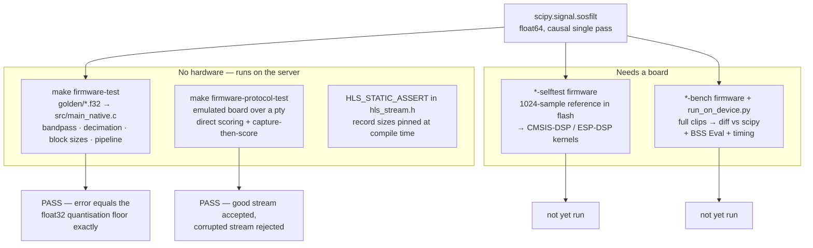
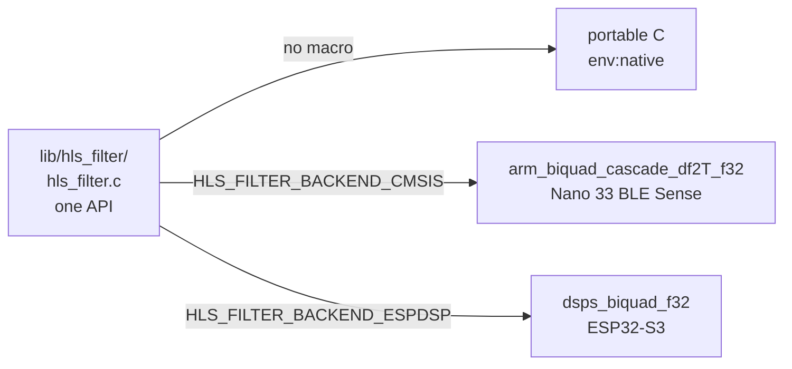
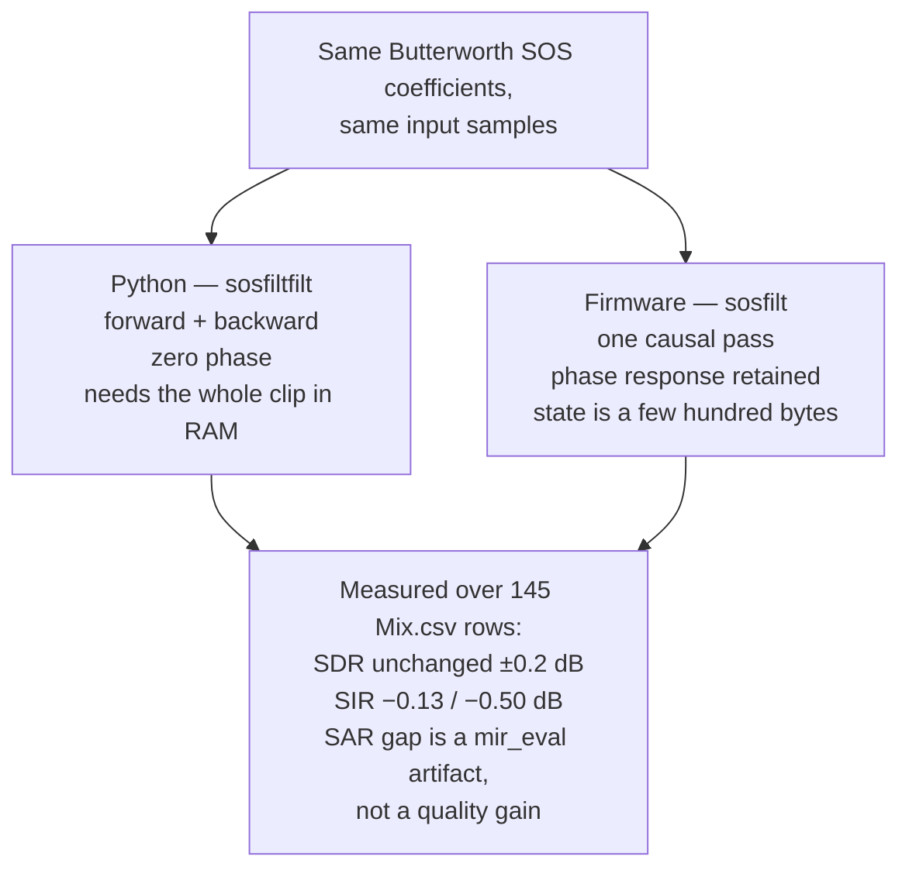

# Firmware pipeline

Flow charts for `firmware/` — what runs where, what the signal goes through, and
how each stage is verified. Prose and rationale live in [README.md](README.md);
this file is the map.

The board has **no microphone in the measurement workflow**. It replays real
HLS-CMDS mixtures compiled into its flash, so the samples it filters are
bit-identical to the ones the Python baseline filters. That is what makes the
on-device output diffable against scipy and scoreable with the same BSS Eval
metrics as everything in `results/`.

---

## 1. Where each piece runs

Three machines, three phases. Nothing is designed on the MCU, and nothing is
measured on the host.

Two edges carry the whole argument. `bands →` means the firmware **imports** its
bands from Baseline 1's module rather than restating them, so the two cannot
drift apart. `clips →` means the board's input is the dataset itself, so the
board's output is comparable to Python's by construction.

---

## 2. Runtime signal path

### Bench path — dataset replay (the measurement path)

Streaming throughout: state is carried across calls, and output is written out
per block, so RAM never scales with clip length. The clips themselves sit in
flash, not RAM.

**No decimation on this path** — the dataset is already at 4000 Hz, so only the
two bandpass cascades run. That is exactly what Baseline 1 does.

### Mic path — live capture (built, not currently used)

The decimator exists because the mics run at 16 kHz while the dataset is at
4000 Hz; without it, content near 3 kHz folds onto 1 kHz, inside the lung band.
It has no Python counterpart, so it is verified against a synthetic signal.

### One biquad section

All three cascades are the same kernel with different coefficients. The
generated header stores scipy's sign convention; the CMSIS backend negates
`a1`/`a2` at init because CMSIS writes the recursion the other way round.

---

## 3. Verification chain

A build that links is not a build that computes the right thing. Three checks
run on the server with no hardware; two more need a board.

The host result is stronger than "close enough": the measured error **equals**
the float32 quantisation floor the generator reports, so the C core performs the
same arithmetic scipy would in `float32` rather than merely something similar.

Order matters on hardware. `*-selftest` before `*-bench`: if the vendor DSP
kernel is wrong, every number the bench produces is wrong in a way that looks
like a filter-design problem.

---

## 4. Build environments

| Environment | `src/` entry point | Backend | Purpose |
|---|---|---|---|
| `native` | `main_native.c` | portable C | diff against scipy on the host |
| `nano33ble-bench` | `main_bench.cpp` | CMSIS-DSP | **replay dataset, measure** |
| `esp32s3-bench` | `main_bench.cpp` | ESP-DSP | **replay dataset, measure** |
| `nano33ble-selftest` | `main_selftest.cpp` | CMSIS-DSP | verify the kernel on silicon |
| `esp32s3-selftest` | `main_selftest.cpp` | ESP-DSP | verify the kernel on silicon |
| `nano33ble` | `main_nano33ble.cpp` | CMSIS-DSP | PDM capture (future device) |
| `esp32s3` | `main_esp32s3.cpp` | ESP-DSP | I2S capture (future device) |

---

## 5. The one deliberate divergence

`make firmware-causal-check` produces that comparison —
`results/firmware_causal_vs_zerophase.html`. The SAR caveat matters: mir_eval's
`_project` fits a *causal* 512-tap distortion filter, which absorbs a causal
IIR's phase response but not a zero-phase filter's acausal one. See
[README.md](README.md#what-it-actually-costs--measured).

On the bench path this is one of only two differences from the Python baseline —
the other being `float32` versus `float64` arithmetic, measured at the
quantisation floor. Same coefficients, same samples, same sample rate.
